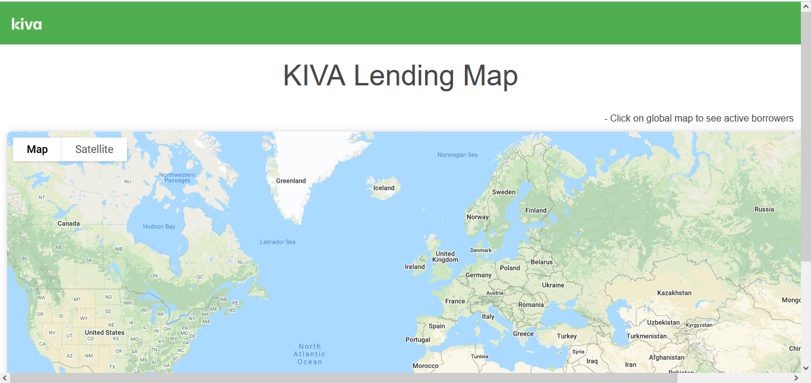
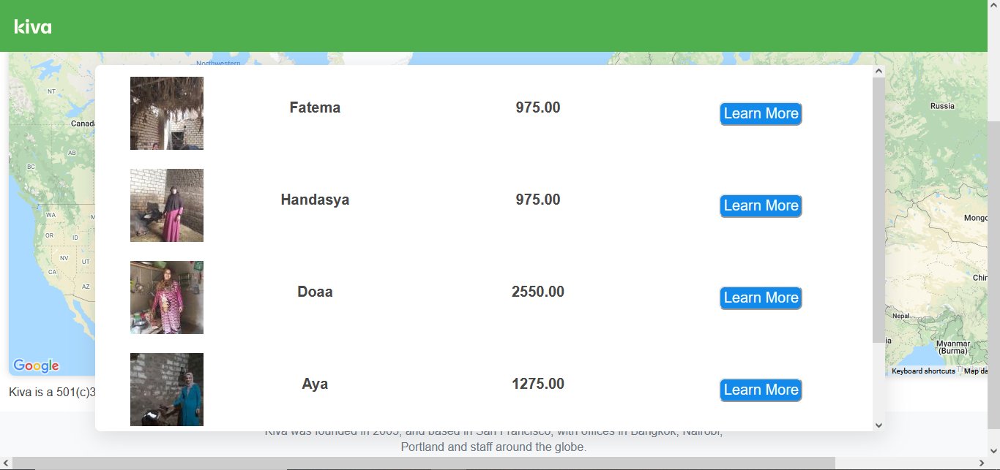
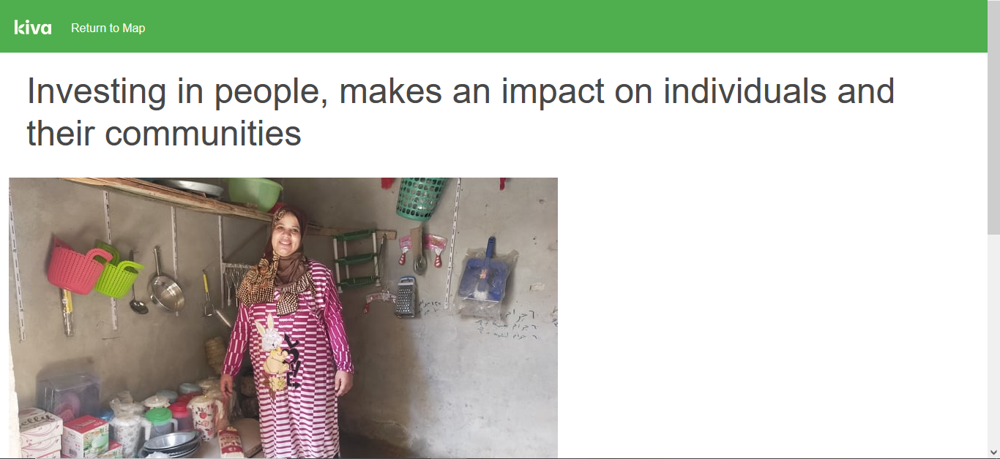
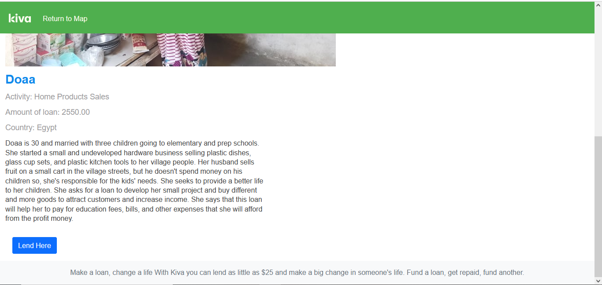

# The Kiva Lending Map

The Kiva Lending Map is a web application that displays an interactive map of KIVA loan lending.  Loans display within a popup window after users click on a  country on the map. The popup displays limited information about the borrower. The user has the ability to utilize the 'learn more' feature to gain additional information about the borrower. With this information, the user then has the option to financially support the borrower on the KIVA website using the 'lend here' button.

# Tech Stack

- JavaScript
- Python
- Flask 
- HTML 
- CSS
- Bootstrap
- GraphQL

# APIs Used
- [Kiva API](https://www.kiva.org/build)
- [Google Maps](https://developers.google.com/maps) 

# Other Resources

- [Clickable Countries Using Google Maps API](https://github.com/arturssmirnovs/Clickable-countries-using-Google-Maps-API)

# Features

## Explore the Map
Users can choose a country and click on the map to discover current Kiva loans. 

## Learn More About the Borrower 
Once a loan is selected, the user can find more information about the current loan. 

# How to Install The Kiva Lending Map!

## Clone repository
Clone my github repo onto your local machine

``git clone https://github.com/aausen/kiva-project.git``

## Create a virtual enviroment
`` virtualenv env ``

## Activate your virutal enviroment
`` source env/bin/activate ``

## Install requirements
`` pip install -r requirements.txt ``

## Install GraphQL
[Getting Started with GraphQL](https://graphql.org/graphql-js/)

## Sign up for Google Developer and get a Google Map API key

## Save your Google Maps API key in ``secrets.sh`` in the following format:
`` export MAP_SECRET_KEY="YourAPIKey" ``

## Source your key from your ``secrets.sh`` file to your virtual env

`` source secrets.sh ``

## Run the application

`` python3 server.py ``

## View in browser

Click the given link to localhost:5000 to view and run in your browser.

_______________________________________________________________________

Copyright 2021 Annie Ausen, Sam Swalve, Tuesday Kay

Licensed under the Apache License, Version 2.0 (the "License");
you may not use this file except in compliance with the License.
You may obtain a copy of the License at

    http://www.apache.org/licenses/LICENSE-2.0

Unless required by applicable law or agreed to in writing, software
distributed under the License is distributed on an "AS IS" BASIS,
WITHOUT WARRANTIES OR CONDITIONS OF ANY KIND, either express or implied.
See the License for the specific language governing permissions and
limitations under the License.